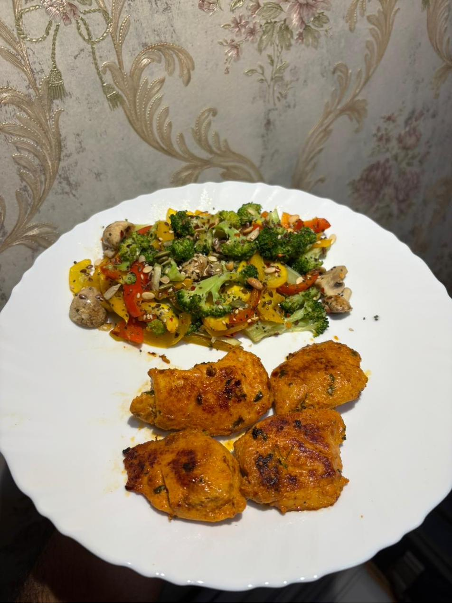

# Recipes

Every recipe is scaled for a **family of 4**, kept short, and tagged with a verified video (🎥), storage note (🧊), and a tip (💡). Pick **one protein anchor**, then add a cooked veg, a salad, dairy, and nuts/seeds.

## Protein anchors

### Moong sprouts usal
**Ingredients (4):** 3 cups moong sprouts · 1 onion · 1 tomato · 1 tsp ginger-garlic · 1 green chilli · 1 tsp mustard + 1 tsp cumin · ½ tsp turmeric · 1 tsp chilli powder · curry leaves · 1 tbsp oil · salt · coriander.

1. Heat oil, splutter mustard + cumin, add curry leaves, onion, ginger-garlic, chilli — sauté till golden.
2. Add tomato + dry spices; cook till soft.
3. Add sprouts + ½ cup water, cover, simmer 8–10 min (keep some crunch).
4. Finish with coriander and a squeeze of lemon.

🎥 <https://www.youtube.com/watch?v=u33FYQVfZ68> · 🧊 Fridge 3 days · 💡 Steam sprouts first for a softer texture.

### Chana / chickpea masala
**Ingredients (4):** 3 cups boiled chickpeas · 2 onions · 2 tomatoes (pureed) · 1 tbsp ginger-garlic · turmeric, chilli, 1 tsp each coriander + cumin powder · 1 tsp garam masala · ½ tsp amchur · 2 tbsp oil · salt · coriander.

1. Sauté onion till deep golden; add ginger-garlic, then tomato puree + spices; cook till oil separates.
2. Add chickpeas + 1 cup water; simmer 10–15 min; mash a few to thicken.
3. Finish with garam masala, amchur, coriander.

🎥 Step-by-step (with video): <https://www.indianhealthyrecipes.com/chana-masala/> · 🧊 Fridge 4–5 days / freeze 1 month

!!! tip "Highest-leverage prep"
    Make a **double batch of the onion-tomato masala base** and freeze it — it becomes the base for chana, paneer, or egg dishes in minutes.

### Grilled paneer on tawa
**Ingredients (4):** 500 g paneer · ½ cup thick curd · 1 tsp chilli · ½ tsp turmeric · ½ tsp garam masala · ½ tsp chaat masala · ½ tsp kasuri methi · 2 tsp roasted besan · 1 tbsp lemon · 1 tsp ginger-garlic · 1 tsp oil.

1. Whisk the marinade; coat paneer; rest **30 min** (no longer — acid makes paneer rubbery).
2. Sear on a medium-high tawa, lightly oiled, 3–4 min/side until charred. Don't move it constantly.

🎥 <https://www.youtube.com/watch?v=BwIJHI4KdIE> · 🧊 Cook fresh for best texture · 💡 Sear marinated capsicum & onion alongside.

### Paneer bhurji
**Ingredients (4):** 500 g paneer (crumbled) · 2 onions · 2 tomatoes · 1 capsicum · 1 green chilli · 1 tsp ginger-garlic · turmeric, chilli, ½ tsp garam masala · 1 tbsp oil · coriander.

Sauté onion → ginger-garlic → capsicum → tomato + spices till soft → add crumbled paneer, toss 3–4 min → coriander.
🧊 Fridge 2 days · 💡 Same recipe with eggs = egg bhurji.

### Egg dishes
- **Boiled eggs:** cover with water, boil 8–9 min, ice-bath, peel. 🧊 In shell, fridge 5–7 days.
- **Vegetable omelette:** beat 8 eggs (for 4) + chopped onion, tomato, capsicum, spinach, chilli, salt, turmeric; cook on ½ tsp ghee, flip once.
- **Egg bhurji:** use the masala base, pour beaten eggs at the end, scramble on **medium-low** (high heat = rubbery).

🎥 Egg bhurji: <https://www.youtube.com/watch?v=1OdPf65aPJg> · 💡 Pull eggs off heat while slightly underdone.

### Chicken tikka on tawa
**Ingredients (4):** 800 g–1 kg boneless chicken · ¾ cup hung curd · 1.5 tbsp ginger-garlic · 2 tbsp lemon · 1.5 tsp Kashmiri chilli · ½ tsp turmeric · 1 tsp garam masala · 1 tsp chaat masala · 1 tsp kasuri methi · 2 tbsp roasted besan · 1 tbsp oil · salt.

1. **First marinade:** chicken + lemon + ginger-garlic + salt, 30 min.
2. **Second marinade:** add hung curd + spices + besan + oil; rest 1 hr → ideally overnight.
3. Sear on a hot tawa/cast-iron, single layer, 4–5 min/side until charred and cooked through (no pink, ~75 °C internal). Work in batches.

🎥 <https://www.youtube.com/watch?v=8L7V1eTaTnw> · 🧊 Marinated raw: fridge 1–2 days or **freeze in marinade** 1 month; cooked: fridge 3 days.

### Chicken–vegetable stir-fry
**Ingredients (4):** 700 g chicken (cubed) · broccoli, red/yellow capsicum, cabbage, onion, cucumber · 1 tbsp ginger-garlic · pepper · chilli flakes · 1 tbsp oil · salt.

Sear chicken first till golden, remove. Stir-fry hard veg on high 3–4 min, then quick-cooking veg; return chicken; toss with pepper, chilli flakes, salt.

💡 High heat + don't crowd the pan = sear, not steam.

## The "binder"

### Besan / moong cheela
**Ingredients (4):** 2 cups besan (or 1.5 cups soaked-&-ground moong dal) · finely chopped onion, tomato, capsicum, spinach/coriander, green chilli · ½ tsp ajwain · ¼ tsp turmeric · salt · water to a spreadable batter · ½ tsp oil per cheela.

Mix to a pourable batter, rest 10 min. On a hot tawa pour a ladle, spread thin, drizzle oil, flip when edges lift. Serve with green chutney.

🎥 <https://www.youtube.com/watch?v=8qUJOvPkpl8> · 💡 Add 2–3 tbsp **sattu** or crumbled paneer to push protein higher.

## Daily sides

### Sautéed mixed vegetables
Hot pan, garlic + onion 1 min → broccoli + capsicum 3–4 min → mushroom 2 min. Season; finish with 1 tbsp mixed seeds. Keep it crisp-tender.

### Sautéed greens / bean sabzi
Garlic + spinach/methi wilted 2–3 min with salt & chilli; or beans/capsicum with mustard-cumin tempering, 6–8 min covered.

### Green soup
Boil chopped lauki (or spinach/broccoli) with onion + garlic till soft (10 min), blend, season with pepper & salt, finish with a spoon of curd/milk. 🧊 Fridge 3 days / freeze.

## Salads (no cooking)
- **Kachumber:** equal tomato + cucumber + onion, coriander, lemon, chaat masala. Dress just before eating.
- **Curd vegetable salad / raita:** fold the above into whisked curd + roasted cumin.
- **Big leafy salad:** lettuce + cabbage + spinach + broccoli + bell pepper + cherry tomato, topped with seeds + nuts, lemon + olive oil.

💡 Store washed-and-**dried** greens with a paper towel in an airtight box; moisture is what makes salad slimy.

## Condiments
- **Hummus:** blend boiled chickpeas + 2 tbsp tahini + 1 garlic + lemon + 2 tbsp olive oil + salt + cumin + a little water. 🧊 Fridge 4–5 days.
- **Green chutney:** blend coriander + mint + green chilli + ginger + lemon + salt. 🧊 Fridge 3–4 days or freeze in cubes.
- **Buttermilk (chaas):** whisk ½ cup curd + 1.5 cups water + roasted cumin + salt + coriander.
- **Toasted nuts & seeds:** dry-toast a big batch, cool, jar it; portion ~25 g/person.

---

## Weekly batch-cooking plan

The system works because most components are prepped once and assembled daily.

=== "Fri/Sat"
    Start sprouting: soak moong & chana overnight → drain → tie in muslin → sprout 1–2 days.

=== "Sunday (~90 min)"
    | Task                               | Yields / keeps                         |
    |------------------------------------|----------------------------------------|
    | Boil a big batch of chickpeas/chana| Fridge 4–5 days / freeze               |
    | Cook the onion-tomato masala base  | Fridge 5 days / freeze — base for many dishes |
    | Boil 6–8 eggs                      | In shell, fridge 5–7 days              |
    | Marinate chicken, freeze in marinade | Freezer 1 month (thaw overnight)     |
    | Make green soup base               | Fridge 3 days / freeze                 |
    | Make hummus + green chutney        | Fridge 4–5 days (chutney freezes)      |
    | Toast a jar of nuts & seeds        | Weeks                                  |
    | Wash/dry greens, pre-cut hardy veg | Airtight, 2–3 days                     |

=== "Every day (10–15 min)"
    - Cook **one** fresh item: cheela / omelette / bhurji / sear paneer or chicken.
    - Reheat one batch item (chana / soup / sprouts usal).
    - Chop a fresh salad, spoon curd, add pre-portioned nuts & seeds. Plate.

### Storage cheat-sheet

| Item                | Fridge      | Freezer   |
|---------------------|-------------|-----------|
| Boiled chana/legumes| 4–5 days    | 1 month   |
| Masala base         | 5 days      | 1 month   |
| Boiled eggs (shell) | 5–7 days    | —         |
| Marinated chicken   | 1–2 days    | 1 month   |
| Cooked curries      | 3–4 days    | 1 month   |
| Soup                | 3 days      | 1 month   |
| Hummus              | 4–5 days    | —         |
| Green chutney       | 3–4 days    | 1 month   |
| Sprouts (raw)       | 2–3 days    | —         |
| Cut hardy veg       | 2–3 days    | —         |

**Cook fresh, don't store:** omelette/cheela, leafy salads, seared paneer.

!!! tip "Cross-cutting tips"
    1. **One base, many meals** — the onion-tomato masala is your highest-leverage prep.
    2. **Hung curd marinades** make paneer/chicken sear instead of steam.
    3. **High heat, uncrowded pan** keeps veg crisp.
    4. **Salt salads last** — salt pulls out water.
    5. **Pre-portion nuts/seeds (~25 g)** so you don't overshoot calories.
